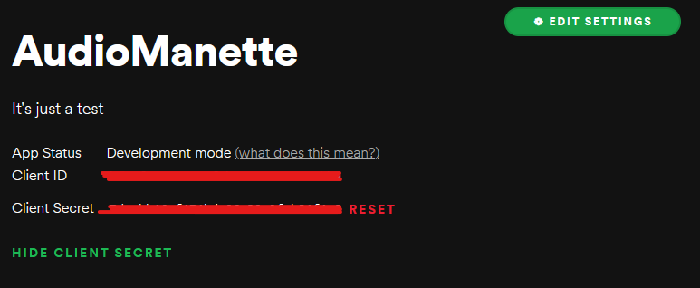
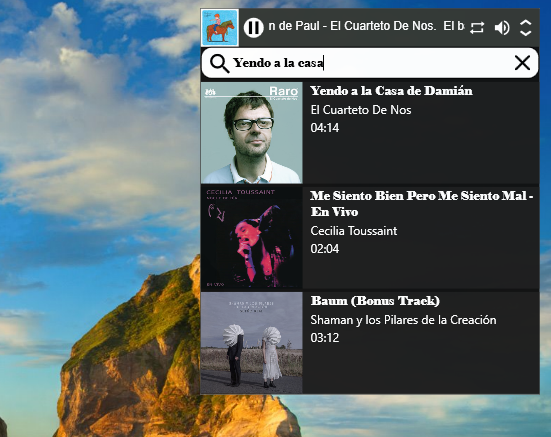

# AudioManette

This document is under construction.

## Brief

AudioManette is a simple remote for Spotify, initially it is not intended to fully sync with the app, thus once the application is opened it must be operated from the provided interface for a proper experience.

## How to use

You must have a Spotify Developer account to access the [Spotify dashboard](https://developer.spotify.com/dashboard/) and create a new app.

Once you have the app, click on "Edit settings" and add `http://localhost:5000/` as the redirect URI.

Set the Client ID and Client Secret from `config/App.config`.

  

## Run

Requires dotnet 6.0 or higher, I'll post the assembly and maybe an installer soon.

    $ dotnet run

## Screenshots

## Resources

- [Material Desing Icons](https://materialdesignicons.com/)

## Authors
- **Jan Carlos Anaya**
